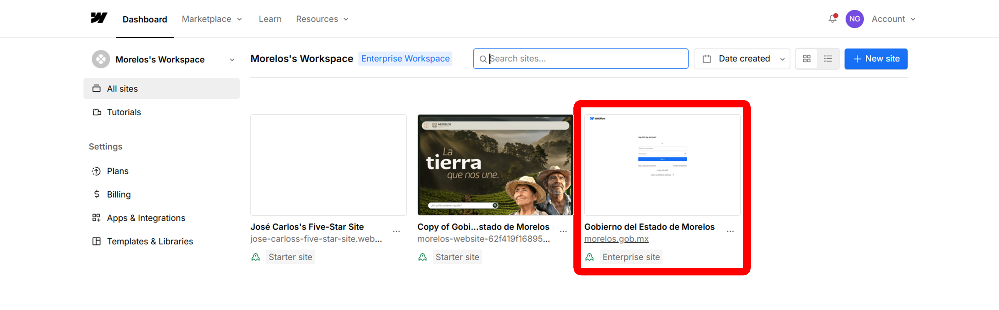

**Sección 2: Acceso a Webflow** 

### **2.1 Acceso a Webflow**

Para comenzar, es importante tener acceso a la plataforma de Webflow y al proyecto asignado. Sigue estos pasos:

1. **Credenciales y enlaces:**

   * Recibirás un enlace para acceder al proyecto en Webflow.  
   * Asegúrate de iniciar sesión con las credenciales proporcionadas.  

2. **Conoce tu  Dashboard Agente de Transformación Digital:**

   * Al ingresar, encontrarás el **Dashboard**, donde podrás ver el proyecto “Gobierno del Estado de Morelos”. (Enterprise site)
   
   
   * Haz clic en el nombre del proyecto para acceder al **Editor**, la herramienta principal que utilizarás.

---