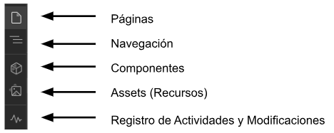

 ### Barra de Navegación ###

En la siguiente imagen podrás visualizar cómo se organiza la barra de navegación dentro de Webflow. Esta barra es esencial para facilitar el acceso a las diferentes secciones y funcionalidades disponibles.

## **Páginas**

En esta sección encontrarás todas las páginas que hayas creado utilizando los templetes disponibles. Aquí podrás ver de forma organizada cada una de ellas, editarlas o duplicarlas según tus necesidades.

> **Nota:** Actualmente se pueden visualizar todas las páginas. Es crucial tener prudencia al seleccionar una página para evitar errores al editar. Es importante tener prudencia al elegir la página a editar, para evitar el error de modificar páginas que no corresponden a nuestra dependencia.

Localizando la carpeta de tu secretaría, desplázate hacia abajo utilizando el scroll para navegar manualmente o escribe el nombre de la carpeta en la barra de búsqueda para ubicarla de forma rápida.

    <iframe 
        src="video/02.mp4" 
        frameborder="0" 
        allowfullscreen 
        style="position: absolute; top: 0; left: 0; width: 100%; height: 100%;">
      </iframe>
   

Cada página se basa en un templete previamente configurado, lo que facilita la creación rápida de contenido y visualmente atractivo para tu sitio web.

## **Navegación** 

En esta sección encontrarás todos los componentes y elementos que conforman tu página web. Podrás ver, mover y organizar estos elementos a tu gusto, lo que te permitirá personalizar la estructura de manera sencilla y rápida.

    <iframe 
        src="video/03.mp4" 
        frameborder="0" 
        allowfullscreen 
        style="position: absolute; top: 0; left: 0; width: 100%; height: 100%;">
      </iframe>
   

## **Componentes**

En esta sección se muestran todos los componentes compartidos y previamente diseñados. Estos componentes están listos para que los arrastres y los coloques directamente en la página que estás creando, lo que simplifica significativamente el proceso de construcción y diseño.

Desde componentes con convocatorias y noticias hasta secciones completas, estos componentes han sido diseñados para mantener un estilo uniforme y profesional en todas las partes de tu sitio, y puedes integrarlos con solo unos clics.

    <iframe 
        src="video/04.mp4" 
        frameborder="0" 
        allowfullscreen 
        style="position: absolute; top: 0; left: 0; width: 100%; height: 100%;">
      </iframe>
   

## **Assets (Recursos)**

En esta sección podrás cargar tus imágenes, logos, iconos o cualquier recurso gráfico que necesites, guardándolos en la carpeta asignada de tu secretaría. Esto te permitirá mantener un mejor control y organización de tus recursos multimedia, facilitando su acceso y uso en futuras creaciones de páginas.

Organiza cada archivo de manera eficiente para que siempre puedas encontrar rápidamente el contenido necesario. Además, asegúrate de que todo esté en el lugar correcto para evitar confusiones.

    <iframe 
        src="video/05.mp4" 
        frameborder="0" 
        allowfullscreen 
        style="position: absolute; top: 0; left: 0; width: 100%; height: 100%;">
      </iframe>
   

